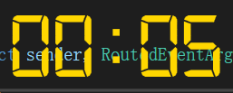
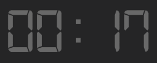

# Chocola Timer

## Screenshot

### active

### inactive

## Instructions

| Action | Description |
|---|---|
| Double Click | Activate/Deactivate |
| Drag | Move |
| Scroll | Adjust size |
| Right Click | Open menu |

## Menu

| Item name | Description |
|---|---|
| Set countdown time | set time in new window and countdown |
| Reset | reset time to zero |
| Reverse | if time increases, then convert to decrease, vice versa |
| Exit | exit |

## Set time window

Press Enter to finish

## Font

You need to setup digital-7 (mono) font
